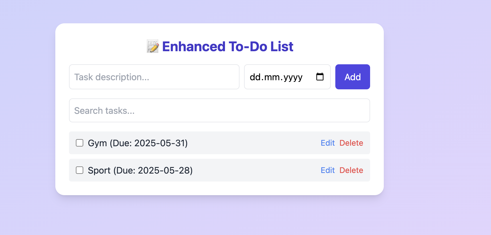

# 📝 Enhanced Todo List App

A sleek, responsive, and fully functional **Todo List** built with **Vanilla JavaScript** and styled using **Tailwind CSS**. This app helps you stay productive and organized with a clean user experience and essential task management features.

---

## 🌟 Features

- 📌 **Add tasks** with optional **due dates**
- ✅ **Mark tasks as completed**
- ✏️ **Edit** tasks in-place
- 🗑️ **Delete** tasks easily
- 🔍 **Search & filter** through tasks
- 💾 **Persistent storage** using `localStorage`
- 🎨 **Responsive** and modern UI with **Tailwind CSS**

---

## 🚀 Live Demo

> Coming soon...

---

## 📸 Screenshots

| Desktop | Mobile |
|--------|--------|
| ') 

---

## 📂 Folder Structure

```bash
todo-app/
├── index.html        # Main application file
├── README.md         # Project documentation
└── screenshots/      # Optional: Screenshots for README
